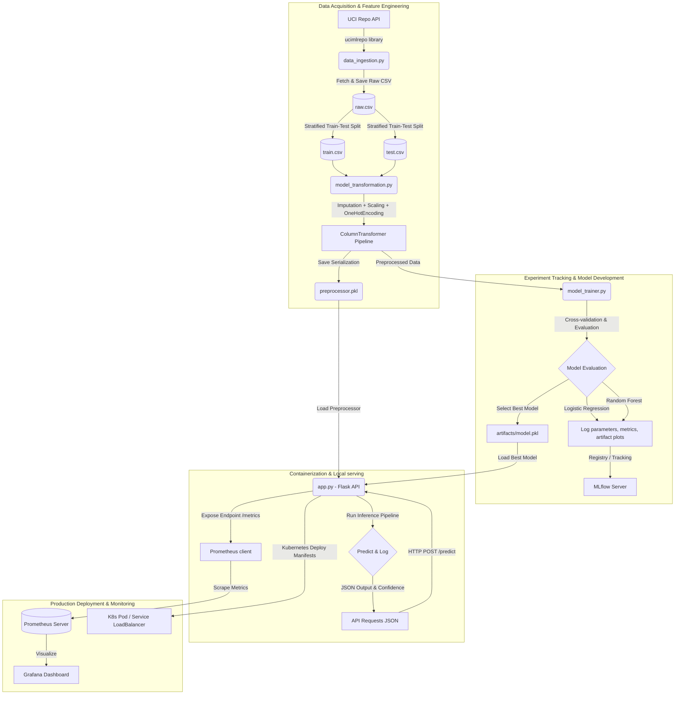

# Heart Disease Prediction MLOps Report

## 1. Objective

The objective of this project is to design, develop, and deploy a scalable, reproducible, and monitored end-to-end Machine Learning classification solution to predict the risk of heart disease based on patient health data. The workflow adheres to modern MLOps best practices: automated data ingestion, robust feature transformation, experiment tracking, unit testing, continuous integration, containerized deployment, and system monitoring.

## 2. Dataset

* **Dataset Name**: Heart Disease UCI Dataset
* **Source**: UCI Machine Learning Repository (Dataset ID: 45)
* **Metadata**: 303 instances, 13 features (categorical, integer, and real-valued features), and 1 target attribute.
* **Target Mapping**: The raw `num` target represents angiographic disease status from 0 (no presence) to 4. In accordance with the assignment, it is binarized:
  - `0`: No presence of heart disease (original value 0).
  - `1`: Presence of heart disease (original values 1, 2, 3, or 4).

## 3. System Architecture

The following diagram illustrates the complete end-to-end architecture of the MLOps pipeline:



## 4. EDA Summary & Findings

Key observations from our exploratory analysis:

* **Class Balance**: The target feature exhibits clean class balance, containing:
  - **No Heart Disease (`0`)**: 164 instances (54.1%)
  - **Heart Disease (`1`)**: 139 instances (45.9%)
* **Missing Value Analysis**:
  - The dataset has missing values in `ca` (4 instances) and `thal` (2 instances).
  - Preprocessing handles these via a robust `SimpleImputer` using `median` for numerical features and `most_frequent` for categorical features.
* **Correlations and Patterns**:
  - **Chest Pain Type (`cp`)**: Strongly correlated with heart disease. Asymptomatic chest pain (Value 4) is a strong positive indicator of risk.
  - **Maximum Heart Rate achieved (`thalach`)**: Higher values correlate with lower risk (no presence), indicating healthy cardiovascular responses during tests.
  - **Exercise-induced Angina (`exang`)** & **ST depression (`oldpeak`)**: Presence of angina and higher ST depression are positive indicators of heart disease risk.

## 5. Feature Engineering & Preprocessing

To ensure a reproducible and leakage-free setup, feature transformation is packaged inside an scikit-learn `ColumnTransformer`:

* **Numerical Features** (`age`, `trestbps`, `chol`, `thalach`, `oldpeak`):
  1. Median Imputation to handle any missing entries.
  2. Z-score normalization (`StandardScaler`) to aid convergence and scaling requirements of linear classifiers.
* **Categorical Features** (`sex`, `cp`, `fbs`, `restecg`, `exang`, `slope`, `ca`, `thal`):
  1. Mode Imputation (`most_frequent` strategy) to handle missing values.
  2. One-hot encoding (`OneHotEncoder`) with unknown values handled gracefully (`handle_unknown="ignore"`).
* **Artifact Serialization**: The fitted preprocessing pipeline is serialized as `artifacts/preprocessor.pkl` for exact reuse during model serving and batch inference.

## 6. Model Development & Evaluation

Two classifiers were trained and compared using 5-fold Stratified Cross-Validation on the training subset, and tested on the hold-out test set (20% split).

### Evaluation Metrics Comparison

| Model | Evaluation Split | Accuracy | Precision | Recall | F1-Score | ROC-AUC |
| :--- | :--- | :---: | :---: | :---: | :---: | :---: |
| **Logistic Regression** | 5-Fold CV (Mean) | 0.84277 | 0.86855 | 0.77391 | 0.81684 | 0.89371 |
| | Hold-out Test Set | **0.88525** | **0.83871** | **0.92857** | **0.88136** | **0.96645** |
| **Random Forest** | 5-Fold CV (Mean) | 0.83444 | 0.83460 | 0.80000 | 0.81525 | 0.89434 |
| | Hold-out Test Set | 0.85246 | 0.80645 | 0.89286 | 0.84746 | 0.92208 |

### Model Selection & Tuning Choices

* **Tuning Details**: 
  - **Logistic Regression**: Configured with `max_iter=1000` to guarantee convergence.
  - **Random Forest**: Standardized with `n_estimators=200`, `max_depth=8`, and `min_samples_leaf=2` to prevent overfitting given the relatively small sample size.
* **Best Model Selection**: **Logistic Regression** was chosen as the production model due to superior generalizability on the test set across all primary metrics, achieving an F1-Score of **0.88136** and an outstanding ROC-AUC of **0.96645**. The final model is serialized to `artifacts/model.pkl`.

## 7. Experiment Tracking (MLflow)

All parameters, metrics, model binaries, and comparison plots are logged to **MLflow** for traceability:
- Runs are separated by model name (`Logistic Regression` & `Random Forest`) under the experiment `heart-disease-classification`.
- A final summary run logs the path to the comparison chart (`artifacts/plots/model_comparison.png`) showing ROC-AUC and Recall.

To review experiments locally:
```bash
mlflow ui
```

## 8. API & Containerization

The serving layer is a Python Flask API wrapped in a production-ready container:
* **Endpoints Exposed**:
  - `GET /health`: Returns application status.
  - `POST /predict`: Accepts a JSON object containing patient features, transforms them via `preprocessor.pkl`, evaluates using `model.pkl`, and returns prediction class, confidence (probability), and a human-readable risk label.
  - `GET /metrics`: Exposes Prometheus metrics (request count, endpoint latency, prediction count).
* **Containerization**: The `Dockerfile` uses `python:3.11-slim` with `gunicorn` for lightweight, concurrent serving.

Docker commands:
```bash
# Build
docker build -t heart-disease-api:latest .

# Run
docker run -p 5000:5000 heart-disease-api:latest
```

## 9. CI/CD Pipeline

Continuous Integration is powered by **GitHub Actions** ([ci.yml](file:///d:/HARSH/Projects/My%20Projects/Machine%20learning/Heart-Disease-Predictions-MLOPS/.github/workflows/ci.yml)):
- Triggers on push or pull requests to `main` and `master`.
- Steps: Checkout -> Setup Python -> Install dependencies -> Run unit tests (`pytest`) -> Run code quality checks (`ruff`) -> Run training pipeline -> Upload training artifacts (`artifacts/`, `logs/`, `mlruns/`).

## 10. Kubernetes Deployment

Production deployment is fully declared in the [k8s/](file:///d:/HARSH/Projects/My%20Projects/Machine%20learning/Heart-Disease-Predictions-MLOPS/k8s) manifests:
- **Deployment**: Exposes the container port `5000` with configured liveness and readiness probes pointing to `/health`.
- **Service**: A `LoadBalancer` mapping port `80` to the container port `5000` for public ingress.

Apply deployment:
```bash
kubectl apply -f k8s/
```

## 11. Monitoring

System metrics are instrumented in [app.py](file:///d:/HARSH/Projects/My%20Projects/Machine%20learning/Heart-Disease-Predictions-MLOPS/app.py) using `prometheus-client`:
* `heart_api_requests_total`: Counter tracking endpoint requests by code and method.
* `heart_api_request_latency_seconds`: Histogram tracking prediction latency.
* `heart_api_predictions_total`: Counter tracking predictions by class (0 vs 1).

Prometheus targets this API through the config in `monitoring/prometheus.yml`.

---

## 12. Screenshots Scaffolding

Ensure screenshots are saved in `docs/screenshots/` showing:
1. **EDA**: Correlation heatmap and class balance plot from the EDA notebook.
2. **MLflow UI**: The experiment runs and parameters compare screen.
3. **GitHub Actions**: A green CI workflow run details tab showing test/lint/train steps.
4. **Docker / Kubernetes**: Local docker execution logs or `kubectl get all` outputs.
5. **Prometheus / Grafana**: The scraped metrics output at `/metrics` or dashboard screen.
