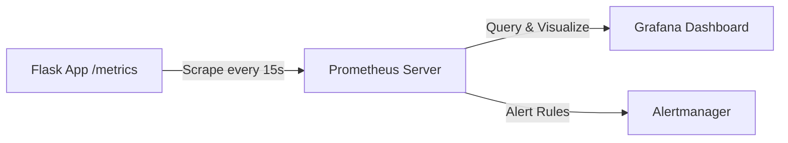

# Heart Disease Prediction — End-to-End MLOps Report

**Author:** Trivedi Harsh Ashutoshbhai  
**BITS ID:** 2024ac05530  
**Repository:** [https://github.com/HARSH6355/Heart-Disease-Predictions-MLOPS](https://github.com/HARSH6355/Heart-Disease-Predictions-MLOPS)  
**Video Link:** [https://1drv.ms/v/c/29b94b9a9e4f5f64/IQDbUJcfORazTKxHeUZBscRaAT3RFqti1EAlmb4lHYaIjKw?e=POGyDB](https://1drv.ms/v/c/29b94b9a9e4f5f64/IQDbUJcfORazTKxHeUZBscRaAT3RFqti1EAlmb4lHYaIjKw?e=POGyDB)  
**Date:** July 2026

---

## Table of Contents

1. [Introduction & Objective](#1-introduction--objective)
2. [Dataset Description](#2-dataset-description)
3. [System Architecture](#3-system-architecture)
4. [Environment Setup & Installation](#4-environment-setup--installation)
5. [Exploratory Data Analysis (EDA)](#5-exploratory-data-analysis-eda)
6. [Feature Engineering & Preprocessing](#6-feature-engineering--preprocessing)
7. [Modelling Choices & Evaluation](#7-modelling-choices--evaluation)
8. [Experiment Tracking with MLflow](#8-experiment-tracking-with-mlflow)
9. [Flask Prediction API & Web Interface](#9-flask-prediction-api--web-interface)
10. [Unit Testing](#10-unit-testing)
11. [CI/CD Pipeline — GitHub Actions](#11-cicd-pipeline--github-actions)
12. [Docker Containerization](#12-docker-containerization)
13. [Kubernetes Deployment](#13-kubernetes-deployment)
14. [Monitoring with Prometheus](#14-monitoring-with-prometheus)
15. [Conclusion & Future Work](#15-conclusion--future-work)

---

## 1. Introduction & Objective

Heart disease remains one of the leading causes of death globally, accounting for approximately 17.9 million deaths each year according to the World Health Organization. Early detection and risk assessment are critical for timely intervention and improved patient outcomes.

The objective of this project is to design, develop, and deploy a **scalable, reproducible, and monitored end-to-end Machine Learning classification solution** to predict the risk of heart disease based on patient health data. The workflow adheres to modern MLOps best practices encompassing:

- **Automated data ingestion** from a trusted public repository
- **Robust feature transformation** using scikit-learn pipelines
- **Experiment tracking** with MLflow for full reproducibility
- **Model serving** via a Flask REST API with a polished web interface
- **Unit testing** with Pytest
- **Continuous Integration** via GitHub Actions
- **Containerized deployment** using Docker
- **Orchestration** with Kubernetes manifests
- **Production monitoring** with Prometheus metrics

This report documents every stage of the pipeline, from raw data to production deployment, with supporting screenshots and technical detail.

---

## 2. Dataset Description

| Property | Value |
|---|---|
| **Name** | Heart Disease UCI Dataset |
| **Source** | UCI Machine Learning Repository (Dataset ID: 45) |
| **Instances** | 303 |
| **Features** | 13 (categorical, integer, and real-valued) |
| **Target** | Binary (0 = No heart disease, 1 = Heart disease) |

### 2.1 Feature Dictionary

| Feature | Description | Type |
|---|---|---|
| `age` | Age in years | Integer |
| `sex` | Sex (1 = Male, 0 = Female) | Categorical |
| `cp` | Chest pain type (1–4) | Categorical |
| `trestbps` | Resting blood pressure (mm Hg) | Integer |
| `chol` | Serum cholesterol (mg/dl) | Integer |
| `fbs` | Fasting blood sugar > 120 mg/dl (1 = Yes, 0 = No) | Categorical |
| `restecg` | Resting ECG results (0–2) | Categorical |
| `thalach` | Maximum heart rate achieved | Integer |
| `exang` | Exercise-induced angina (1 = Yes, 0 = No) | Categorical |
| `oldpeak` | ST depression induced by exercise relative to rest | Float |
| `slope` | Slope of the peak exercise ST segment (1–3) | Categorical |
| `ca` | Number of major vessels (0–3) coloured by fluoroscopy | Float |
| `thal` | Thalassemia (3 = Normal, 6 = Fixed defect, 7 = Reversible defect) | Categorical |

### 2.2 Target Variable Mapping

The raw `num` target in the UCI dataset represents angiographic disease status from 0 (no presence) to 4 (severe). In accordance with standard practice, this is binarized:

- **0** — No presence of heart disease (original value 0)
- **1** — Presence of heart disease (original values 1, 2, 3, or 4)

---

## 3. System Architecture

The following diagram illustrates the complete end-to-end architecture of the MLOps pipeline, from data acquisition to production monitoring:


### 3.1 Project Structure

```text
Heart-Disease-Predictions-MLOPS/
├── src/
│   ├── components/
│   │   ├── data_ingestion.py        # Fetches UCI dataset, splits train/test
│   │   ├── model_transformation.py  # Preprocessing pipeline (impute + scale + encode)
│   │   └── model_trainer.py         # Trains models, logs to MLflow
│   ├── pipeline/
│   │   ├── train_pipeline.py        # Orchestrates full training workflow
│   │   └── predict_pipeline.py      # Inference pipeline for serving
│   ├── config/
│   │   └── configuration.py         # Centralized configuration
│   ├── utils.py                     # Serialization, evaluation helpers
│   ├── logger.py                    # Structured logging setup
│   └── exception.py                 # Custom exception handling
├── app.py                           # Flask REST API
├── templates/
│   └── index.html                   # Web UI for predictions
├── static/
│   └── style.css                    # UI styling
├── notebooks/
│   ├── EDA.ipynb                    # Exploratory Data Analysis
│   └── Model_Training.ipynb         # Model training notebook
├── tests/
│   ├── test_data_ingestion.py       # Data ingestion tests
│   └── test_prediction_schema.py    # Prediction schema tests
├── artifacts/
│   ├── data/                        # Raw, train, test CSVs
│   ├── model.pkl                    # Best trained model
│   ├── preprocessor.pkl             # Fitted preprocessor
│   └── plots/
│       └── model_comparison.png     # Model comparison chart
├── .github/workflows/
│   └── ci.yml                       # GitHub Actions CI pipeline
├── k8s/
│   ├── deployment.yaml              # Kubernetes Deployment
│   └── service.yaml                 # Kubernetes Service
├── monitoring/
│   └── prometheus.yml               # Prometheus scrape configuration
├── Dockerfile                       # Container build instructions
├── requirements.txt                 # Python dependencies
├── setup.py                         # Package setup
└── environment.yml                  # Conda environment specification
```

---

## 4. Environment Setup & Installation

### 4.1 Prerequisites

- **Python 3.11+**
- **Conda** (Miniconda or Anaconda)
- **Git**
- **Docker Desktop** (for containerization)
- **kubectl + Minikube** or Docker Desktop Kubernetes (for K8s deployment)

### 4.2 Clone the Repository

```bash
git clone https://github.com/HARSH6355/Heart-Disease-Predictions-MLOPS.git
cd Heart-Disease-Predictions-MLOPS
```

### 4.3 Create and Activate the Conda Environment

**Option A — Using the existing local `.conda` environment (Windows PowerShell):**

```powershell
.\.conda\python.exe -m pip install -r requirements.txt
.\.conda\python.exe -m pip install -e .
```

**Option B — Creating a fresh Conda environment:**

```bash
conda env create -f environment.yml
conda activate heart-disease-mlops
pip install -r requirements.txt
pip install -e .
```

### 4.4 Python Dependencies

The project relies on the following key libraries defined in `requirements.txt`:

| Library | Purpose |
|---|---|
| `pandas`, `numpy` | Data manipulation and numerical operations |
| `scikit-learn` | Preprocessing, model training, and evaluation |
| `matplotlib`, `seaborn` | Data visualization |
| `flask` | REST API web framework |
| `dill` | Object serialization (models and preprocessors) |
| `mlflow` | Experiment tracking and model registry |
| `ucimlrepo` | Programmatic dataset fetching from UCI repository |
| `pytest` | Unit testing framework |
| `prometheus-client` | Prometheus metrics instrumentation |
| `gunicorn` | Production WSGI server |
| `ruff` | Python code linting |

### 4.5 Train the Model

```powershell
.\.conda\python.exe -m src.pipeline.train_pipeline
```

This generates the following artifacts:

- `artifacts/data/raw.csv` — Full raw dataset
- `artifacts/data/train.csv` — Training split (80%)
- `artifacts/data/test.csv` — Test split (20%)
- `artifacts/preprocessor.pkl` — Fitted preprocessing pipeline
- `artifacts/model.pkl` — Best performing model
- `artifacts/plots/model_comparison.png` — Visual model comparison
- `mlruns/` — MLflow experiment tracking data

### 4.6 Run the API

```powershell
.\.conda\python.exe app.py
```

The API starts on `http://127.0.0.1:8080` with the following endpoints:

| Endpoint | Method | Description |
|---|---|---|
| `/` | GET | Web-based prediction form |
| `/health` | GET | Health check (returns `{"status": "ok"}`) |
| `/predict` | POST | Accepts patient JSON, returns prediction |
| `/metrics` | GET | Prometheus metrics endpoint |

### 4.7 Launch MLflow UI

```powershell
.\.conda\Scripts\mlflow.exe ui --backend-store-uri sqlite:///mlflow.db
```

Open the MLflow dashboard at `http://127.0.0.1:5000`.

---

## 5. Exploratory Data Analysis (EDA)

A comprehensive EDA was conducted in `notebooks/EDA.ipynb` to understand the dataset characteristics, identify patterns, and inform modelling decisions.

### 5.1 Data Loading & Metadata

The dataset was loaded programmatically from the UCI Machine Learning Repository using the `ucimlrepo` library. The metadata confirms 303 instances across 13 features with a single target column.


### 5.2 Variable Information

Each feature's role (Feature/Target), data type (Integer, Categorical, Float), and missing value status was examined. Notable findings: `ca` has 4 missing values and `thal` has 2 missing values.


### 5.3 Data Shape & Schema

Using `df.info()`, the dataset shape of **(303, 14)** was confirmed. All 303 entries are present for most columns, with minor missing data in `ca` (299 non-null) and `thal` (301 non-null).


### 5.4 Statistical Summary

`df.describe()` provided summary statistics across all numerical features. Key observations:

- **Age** ranges from 29 to 77 years, with a mean of 54.4 years
- **Cholesterol** ranges from 126 to 564 mg/dl
- **Maximum Heart Rate** ranges from 71 to 202 bpm
- **Resting BP** ranges from 94 to 200 mm Hg

The raw target distribution (`df.num.value_counts()`) showed: 164 (no disease), 55, 36, 35, and 13 across severity levels 0–4.


### 5.5 Target Binarization

The multi-class target was binarized into a binary classification problem:

```python
df['num'] = df['num'].apply(lambda x: 0 if x == 0 else 1)
df.rename(columns={'num': 'target'}, inplace=True)
```

After binarization, the dataset shape remained **(303, 14)** with balanced classes.


### 5.6 Target Class Distribution

The class distribution is approximately balanced:

- **No Heart Disease (0):** 164 instances (54.1%)
- **Heart Disease (1):** 139 instances (45.9%)

This near-balanced distribution is advantageous as it eliminates the need for class imbalance techniques such as SMOTE or class weighting.


### 5.7 Correlation Analysis

A correlation heatmap was generated to identify relationships between features and the target variable:


**Key Correlation Findings:**

| Feature | Correlation with Target | Interpretation |
|---|---|---|
| `thal` | **+0.53** | Strongest positive association |
| `ca` | **+0.46** | Number of fluoroscopy-coloured vessels |
| `exang` | **+0.42** | Exercise-induced angina is a strong indicator |
| `oldpeak` | **+0.42** | ST depression correlates with disease |
| `cp` | **+0.41** | Chest pain type is highly predictive |
| `thalach` | **−0.42** | Higher max heart rate → lower risk |
| `slope` | **+0.33** | Peak exercise ST segment slope |

Additionally, no severe multicollinearity was observed among predictors, with the highest inter-feature correlation being 0.58 between `oldpeak` and `slope`.


### 5.8 Feature vs. Target Analysis — Chest Pain Type

Analysis of chest pain types revealed a strong association with heart disease status:

- **Asymptomatic (cp=4):** Highest prevalence of heart disease
- **Typical Angina (cp=1), Atypical Angina (cp=2), Non-Anginal Pain (cp=3):** More frequently observed among individuals without heart disease

These findings confirm that chest pain type is an important predictive feature for heart disease diagnosis.


---

## 6. Feature Engineering & Preprocessing

Feature transformation is implemented in `src/components/model_transformation.py` using scikit-learn's `ColumnTransformer` to ensure a **reproducible, leakage-free** preprocessing pipeline.

### 6.1 Feature Categorization

Features are split into two groups:

**Numerical Features:** `age`, `trestbps`, `chol`, `thalach`, `oldpeak`

**Categorical Features:** `sex`, `cp`, `fbs`, `restecg`, `exang`, `slope`, `ca`, `thal`

### 6.2 Preprocessing Pipeline

```python
# Numerical pipeline
numeric_pipeline = Pipeline([
    ("imputer", SimpleImputer(strategy="median")),
    ("scaler", StandardScaler()),
])

# Categorical pipeline
categorical_pipeline = Pipeline([
    ("imputer", SimpleImputer(strategy="most_frequent")),
    ("one_hot_encoder", OneHotEncoder(handle_unknown="ignore")),
])

# Combined preprocessor
preprocessor = ColumnTransformer([
    ("num_pipeline", numeric_pipeline, numerical_columns),
    ("cat_pipeline", categorical_pipeline, categorical_columns),
])
```

### 6.3 Design Decisions

| Decision | Rationale |
|---|---|
| **Median imputation** for numerical features | Robust to outliers in clinical measurements |
| **Mode imputation** for categorical features | Preserves the most common category |
| **StandardScaler** for numerical features | Z-score normalization aids convergence of Logistic Regression |
| **OneHotEncoder** with `handle_unknown="ignore"` | Handles unseen categories during inference gracefully |
| **Artifact serialization** (`preprocessor.pkl`) | Ensures exact same transformation at training and inference time |

### 6.4 Data Splitting Strategy

- **Train/Test Ratio:** 80/20 split
- **Stratification:** Stratified on the target column to maintain class proportions in both splits
- **Random State:** Fixed at 42 for reproducibility

---

## 7. Modelling Choices & Evaluation

Two classification models were trained and compared in `src/components/model_trainer.py`. The evaluation strategy combines 5-fold Stratified Cross-Validation on the training set with a final evaluation on the held-out test set.

### 7.1 Model Configurations

**Logistic Regression:**
- `max_iter=1000` — Ensures convergence with high-dimensional one-hot encoded features
- `random_state=42` — Reproducibility

**Random Forest Classifier:**
- `n_estimators=200` — Sufficient ensemble size for a 303-sample dataset
- `max_depth=8` — Prevents overfitting on a small dataset
- `min_samples_leaf=2` — Additional regularization
- `random_state=42` — Reproducibility

### 7.2 Evaluation Metrics

The following metrics were computed for comprehensive model assessment:

| Metric | Why It Matters |
|---|---|
| **Accuracy** | Overall correctness |
| **Precision** | Proportion of positive predictions that are correct |
| **Recall** | Proportion of actual positives correctly identified (critical in healthcare) |
| **F1-Score** | Harmonic mean of precision and recall |
| **ROC-AUC** | Discrimination ability across all thresholds |

### 7.3 Results Comparison

| Model | Split | Accuracy | Precision | Recall | F1-Score | ROC-AUC |
|---|---|:---:|:---:|:---:|:---:|:---:|
| **Logistic Regression** | 5-Fold CV (Mean) | 0.843 | 0.869 | 0.774 | 0.817 | 0.894 |
| | **Hold-out Test** | **0.885** | **0.839** | **0.929** | **0.881** | **0.966** |
| **Random Forest** | 5-Fold CV (Mean) | 0.834 | 0.835 | 0.800 | 0.815 | 0.894 |
| | Hold-out Test | 0.852 | 0.806 | 0.893 | 0.847 | 0.922 |

### 7.4 Model Comparison Visualization


### 7.5 Model Selection Rationale

**Logistic Regression** was selected as the production model based on:

1. **Superior ROC-AUC (0.966 vs. 0.922):** Demonstrates better discrimination ability across all probability thresholds.
2. **Higher Recall (0.929 vs. 0.893):** In a healthcare context, minimizing false negatives (missed heart disease cases) is critical. Logistic Regression correctly identifies 92.9% of actual heart disease cases.
3. **Better F1-Score (0.881 vs. 0.847):** Best balance of precision and recall.
4. **Interpretability:** Logistic Regression provides interpretable coefficients, enabling clinicians to understand which features drive predictions.
5. **Simplicity:** Fewer hyperparameters reduce the risk of overfitting on this relatively small dataset.

The selected model is serialized to `artifacts/model.pkl` using `dill` for production deployment.

---

## 8. Experiment Tracking with MLflow

All experiments are tracked using **MLflow** with a SQLite backend (`mlflow.db`). Every training run logs:

- **Parameters:** Model name, hyperparameters (e.g., `max_iter`, `n_estimators`, `max_depth`)
- **Metrics:** Accuracy, Precision, Recall, F1-Score, ROC-AUC (both CV and test set)
- **Artifacts:** Trained model binaries, comparison plots

### 8.1 MLflow Experiment Dashboard

The `heart-disease-classification` experiment contains three runs:

1. **Logistic Regression** — Full training with all metrics
2. **Random Forest** — Full training with all metrics
3. **best-model-summary** — Summary run logging the winner and the comparison chart


### 8.2 Metrics Comparison View

MLflow's built-in chart view enables side-by-side comparison of all metrics across runs:


### 8.3 How to Reproduce

```powershell
# Run the training pipeline (logs are created automatically)
.\.conda\python.exe -m src.pipeline.train_pipeline

# Launch MLflow UI to inspect experiments
.\.conda\Scripts\mlflow.exe ui --backend-store-uri sqlite:///mlflow.db
```

Navigate to `http://127.0.0.1:5000` → Select the `heart-disease-classification` experiment → Compare runs.

---

## 9. Flask Prediction API & Web Interface

The serving layer is a Python Flask application (`app.py`) that loads the trained model and preprocessor to serve real-time predictions via REST endpoints and a web-based form.

### 9.1 API Endpoints

| Endpoint | Method | Description | Response |
|---|---|---|---|
| `/` | GET | Serves the prediction web form | HTML page |
| `/health` | GET | Health check | `{"status": "ok"}` |
| `/predict` | POST | Accepts patient data, returns prediction | `{"prediction": 0/1, "confidence": float, "risk_label": string}` |
| `/metrics` | GET | Prometheus metrics | Plain text metrics |

### 9.2 Prediction Flow

1. User submits patient data via the web form or API call
2. Flask receives the JSON payload and validates all 13 required fields
3. Input is converted to a `HeartDiseaseInput` dataclass and then to a DataFrame
4. The preprocessor (`preprocessor.pkl`) transforms features identically to training
5. The model (`model.pkl`) generates a prediction and confidence score
6. Response is returned with prediction class, confidence, and human-readable risk label

### 9.3 Web Interface

The web UI provides a modern, dark-themed form for entering patient data:


### 9.4 Prediction Result

After submitting patient data, the result card shows the prediction with a confidence bar:


### 9.5 Sample API Request

```powershell
Invoke-RestMethod -Uri http://127.0.0.1:8080/predict `
  -Method Post `
  -ContentType "application/json" `
  -Body '{"age":54,"sex":1,"cp":4,"trestbps":130,"chol":250,"fbs":0,"restecg":1,"thalach":150,"exang":0,"oldpeak":1.0,"slope":2,"ca":0,"thal":3}'
```

**Sample Response:**
```json
{
  "prediction": 1,
  "confidence": 0.563,
  "risk_label": "heart disease risk"
}
```

---

## 10. Unit Testing

Automated tests are implemented using **Pytest** to validate critical components.

### 10.1 Test Coverage

| Test File | What It Tests |
|---|---|
| `tests/test_data_ingestion.py` | Validates that the data ingestion configuration produces valid file paths and default parameters |
| `tests/test_prediction_schema.py` | Validates the `HeartDiseaseInput` dataclass schema, ensuring all 13 fields are correctly defined and convertible to a DataFrame |

### 10.2 Running Tests

```powershell
.\.conda\python.exe -m pytest -q tests
```

All tests pass successfully, confirming the integrity of the data ingestion and prediction schema components.

---

## 11. CI/CD Pipeline — GitHub Actions

Continuous Integration is implemented via **GitHub Actions** in `.github/workflows/ci.yml`. The pipeline automates testing, linting, training, and artifact collection on every push or pull request.

### 11.1 Workflow Configuration

```yaml
name: mlops-ci

on:
  push:
    branches: ["main", "master"]
  pull_request:
    branches: ["main", "master"]
  workflow_dispatch:

jobs:
  test-and-train:
    runs-on: ubuntu-latest
    steps:
      - Checkout repository
      - Set up Python 3.11
      - Install dependencies (pip install -r requirements.txt && pip install -e .)
      - Run unit tests (pytest -q)
      - Run linting (ruff check .)
      - Run training pipeline (python -m src.pipeline.train_pipeline)
      - Upload generated artifacts (artifacts/, logs/, mlruns/)
```

### 11.2 GitHub Actions — Workflow Runs

The CI pipeline runs successfully on both push events and manual triggers:


### 11.3 GitHub Actions — Job Steps

All steps in the `test-and-train` job complete successfully:

| Step | Duration | Status |
|---|---|---|
| Set up job | 0s | ✅ |
| Checkout repository | 2s | ✅ |
| Set up Python | 0s | ✅ |
| Install dependencies | 1m 15s | ✅ |
| Run unit tests | 2s | ✅ |
| Run linting | 0s | ✅ |
| Run training pipeline | 22s | ✅ |
| Upload generated artifacts | 2s | ✅ |


---

## 12. Docker Containerization

The application is containerized using a production-ready `Dockerfile` for consistent deployment across environments.

### 12.1 Dockerfile

```dockerfile
FROM python:3.11-slim

WORKDIR /app

ENV PYTHONDONTWRITEBYTECODE=1
ENV PYTHONUNBUFFERED=1

COPY requirements.txt setup.py ./
COPY src ./src
COPY templates ./templates
COPY static ./static
COPY artifacts ./artifacts
COPY app.py ./

RUN pip install --no-cache-dir --upgrade pip \
    && pip install --no-cache-dir -r requirements.txt \
    && pip install --no-cache-dir -e .

EXPOSE 5000

CMD ["gunicorn", "--bind", "0.0.0.0:5000", "app:app"]
```

### 12.2 Build & Run Commands

```bash
# Build the Docker image
docker build -t heart-disease-api:latest .

# Run the container
docker run -p 5000:5000 heart-disease-api:latest
```

### 12.3 Docker Desktop — Image Built

The `heart-disease-api:latest` image was successfully built and is visible in Docker Desktop:


### 12.4 Docker Container — Running

The container runs with Gunicorn (production WSGI server) and logs confirm successful startup:


### 12.5 Key Design Decisions

| Decision | Rationale |
|---|---|
| `python:3.11-slim` base image | Minimal footprint while maintaining compatibility |
| `PYTHONDONTWRITEBYTECODE=1` | Prevents `.pyc` file generation in container |
| `PYTHONUNBUFFERED=1` | Ensures logs are flushed immediately |
| `gunicorn` instead of Flask dev server | Production-grade, concurrent request handling |
| Pre-trained artifacts copied into image | No training required at runtime; fast cold starts |

---

## 13. Kubernetes Deployment

For production-grade orchestration, Kubernetes manifests are provided in the `k8s/` directory.

### 13.1 Deployment Manifest (`k8s/deployment.yaml`)

```yaml
apiVersion: apps/v1
kind: Deployment
metadata:
  name: heart-disease-api
spec:
  replicas: 1
  selector:
    matchLabels:
      app: heart-disease-api
  template:
    spec:
      containers:
        - name: heart-disease-api
          image: heart-disease-api:latest
          ports:
            - containerPort: 5000
          readinessProbe:
            httpGet:
              path: /health
              port: 5000
            initialDelaySeconds: 10
            periodSeconds: 10
          livenessProbe:
            httpGet:
              path: /health
              port: 5000
            initialDelaySeconds: 20
            periodSeconds: 20
```

### 13.2 Service Manifest (`k8s/service.yaml`)

```yaml
apiVersion: v1
kind: Service
metadata:
  name: heart-disease-api-service
spec:
  type: LoadBalancer
  selector:
    app: heart-disease-api
  ports:
    - protocol: TCP
      port: 80
      targetPort: 5000
```

### 13.3 Deploy to Kubernetes

```bash
kubectl apply -f k8s/
kubectl get pods
kubectl get svc
```

### 13.4 Kubernetes — Deployment Results

Successful deployment showing the pod running and service exposed via LoadBalancer:


**Deployment Status:**
- **Pod:** `heart-disease-api-cb4c58f7c-rpf9z` — `1/1 Running`, 0 restarts
- **Service:** `heart-disease-api-service` — `LoadBalancer`, External IP: `localhost:30364`

### 13.5 Application Running on Kubernetes

The application served through Kubernetes on `localhost`:


### 13.6 Prediction via Kubernetes

Making a prediction through the Kubernetes-served application:


### 13.7 Health Probes

| Probe Type | Path | Initial Delay | Period |
|---|---|---|---|
| **Readiness** | `/health` | 10s | 10s |
| **Liveness** | `/health` | 20s | 20s |

These probes ensure Kubernetes automatically restarts unhealthy pods and only routes traffic to ready instances.

---

## 14. Monitoring with Prometheus

The API is instrumented with **Prometheus** metrics using the `prometheus-client` Python library for production observability.

### 14.1 Instrumented Metrics

| Metric Name | Type | Description | Labels |
|---|---|---|---|
| `heart_api_requests_total` | Counter | Total API requests | endpoint, method, http_status |
| `heart_api_request_latency_seconds` | Histogram | Request latency in seconds | endpoint |
| `heart_api_predictions_total` | Counter | Total predictions by class | prediction (0 or 1) |

### 14.2 Prometheus Configuration

The `monitoring/prometheus.yml` configuration scrapes the Flask app's `/metrics` endpoint:

```yaml
global:
  scrape_interval: 15s

scrape_configs:
  - job_name: "heart-disease-api"
    metrics_path: /metrics
    static_configs:
      - targets: ["host.docker.internal:5000"]
```

### 14.3 Accessing Metrics

The metrics endpoint at `/metrics` exposes Prometheus-formatted data:

```
# HELP heart_api_requests_total Total API requests
# TYPE heart_api_requests_total counter
heart_api_requests_total{endpoint="/predict",method="POST",http_status="200"} 5.0

# HELP heart_api_request_latency_seconds API request latency in seconds
# TYPE heart_api_request_latency_seconds histogram
heart_api_request_latency_seconds_bucket{endpoint="/predict",le="0.005"} 0.0
heart_api_request_latency_seconds_bucket{endpoint="/predict",le="0.01"} 3.0
...

# HELP heart_api_predictions_total Total predictions by class
# TYPE heart_api_predictions_total counter
heart_api_predictions_total{prediction="1"} 3.0
heart_api_predictions_total{prediction="0"} 2.0
```

### 14.4 Monitoring Architecture



This setup enables:
- **Request rate monitoring** — Track API traffic patterns
- **Latency percentiles** — Identify performance degradation
- **Prediction drift detection** — Monitor class distribution changes over time

---

## 15. Conclusion & Future Work

### 15.1 Summary

This project demonstrates a complete, production-ready MLOps lifecycle for heart disease risk prediction:

| Component | Implementation |
|---|---|
| **Data Acquisition** | Automated from UCI Repository via `ucimlrepo` |
| **EDA** | Comprehensive analysis with 11 visualizations |
| **Preprocessing** | Reproducible scikit-learn `ColumnTransformer` pipeline |
| **Model Training** | Logistic Regression vs. Random Forest comparison |
| **Experiment Tracking** | MLflow with SQLite backend |
| **Model Serving** | Flask REST API with web interface |
| **Testing** | Pytest unit tests |
| **CI/CD** | GitHub Actions (test → lint → train → upload artifacts) |
| **Containerization** | Docker with Gunicorn |
| **Orchestration** | Kubernetes with health probes |
| **Monitoring** | Prometheus metrics instrumentation |

The best performing model (**Logistic Regression**) achieved an F1-Score of **0.881** and ROC-AUC of **0.966** on the test set.

### 15.2 Future Improvements

1. **Model Enhancement:** Explore gradient boosting methods (XGBoost, CatBoost) and hyperparameter optimization with Optuna
2. **Data Drift Monitoring:** Integrate Evidently AI for automated data and model drift detection
3. **Model Registry:** Leverage MLflow Model Registry for versioned model deployment with staging/production stages
4. **Grafana Dashboards:** Create visual dashboards for real-time monitoring of prediction latency, request rates, and class distributions
5. **A/B Testing:** Implement canary deployments to compare model versions in production
6. **Authentication:** Add API key or OAuth2 authentication for the prediction endpoint
7. **Batch Prediction:** Support batch inference for large-scale patient screening

---

## Code Repository & Video Link

**GitHub:** [https://github.com/HARSH6355/Heart-Disease-Predictions-MLOPS](https://github.com/HARSH6355/Heart-Disease-Predictions-MLOPS)

**Video Link:** [https://1drv.ms/v/c/29b94b9a9e4f5f64/IQDbUJcfORazTKxHeUZBscRaAT3RFqti1EAlmb4lHYaIjKw?e=POGyDB](https://1drv.ms/v/c/29b94b9a9e4f5f64/IQDbUJcfORazTKxHeUZBscRaAT3RFqti1EAlmb4lHYaIjKw?e=POGyDB)

